print('PyDev console: using IPython 8.18.1\n')

import sys; print('Python %s on %s' % (sys.version, sys.platform))

sys.path.extend(['/root/PycharmProjects/Transformers\_project'])

import torchtext.datasets as datasets

import torch

import torch.nn as nn

from torch.utils.data import Dataset, DataLoader, random\_split

from torch.optim.lr\_scheduler import LambdaLR

import warnings

from tqdm import tqdm

import os

from pathlib import Path

from datasets import load\_dataset

from tokenizers import Tokenizer

from tokenizers.models import WordLevel

from tokenizers.trainers import WordLevelTrainer

from tokenizers.pre\_tokenizers import Whitespace

import torchmetrics

from torch.utils.tensorboard import SummaryWriter

from torchmetrics.text import CharErrorRate, WordErrorRate, BLEUScore

from torchmetrics.text import BLEUScore, ROUGEScore

batch\_size= 8,

\# num\_epochs= 20,

num\_epochs= 2,

lr= 10 \*\* -4,

seq\_len= 350,

d\_model= 512,

datasource= 'opus\_books',

lang\_src= "en",

lang\_tgt= "it",

model\_folder= "weights",

model\_basename= "tmodel\_",

preload= "latest",

tokenizer\_file= "tokenizer\_{0}.json",

experiment\_name= "runs/tmodel"

ds\_raw = load\_dataset(f"{datasource[0]}", f"{lang\_src[0]}-{lang\_tgt[0]}", split='train')

\# ds\_raw = load\_dataset("parquet", data\_files="/root/PycharmProjects/Transformers\_project/pytorch-transformer/parquet\_dataset.parquet")

def get\_all\_sentences(ds, lang):

`    `for item in ds:

`        `yield item['translation'][lang]

ds\_raw = load\_dataset(f"{datasource[0]}", f"{lang\_src[0]}-{lang\_tgt[0]}", split='train')

import os

os.environ["TOKENIZERS\_PARALLELISM"] = "false"

def get\_all\_sentences(ds, lang):

`    `for item in ds:

`        `yield item['translation'][lang]

tokenizer = Tokenizer(WordLevel(unk\_token="[UNK]"))

tokenizer.pre\_tokenizer = Whitespace() # pre tokenizer is set to whitespace

#UNK: represents UnKnown tokens [SOS: start of sequence] [EOD: end of token]/ minimum freq of any word repeated kess than 2 times is replaced by unknown token.

trainer = WordLevelTrainer(special\_tokens=["[UNK]", "[PAD]", "[SOS]", "[EOS]"], min\_frequency=2)

tokenizer.train\_from\_iterator(get\_all\_sentences(ds\_raw, lang\_src[0]), trainer=trainer)# standard hf format for tokenization

tokenizer\_path = Path(tokenizer\_file[0].format('en'))

tokenizer.save(str(tokenizer\_path))

tokenizer\_src=Tokenizer.from\_file(str(Path(tokenizer\_file[0].format('en'))))

tokenizer = Tokenizer(WordLevel(unk\_token="[UNK]"))

tokenizer.pre\_tokenizer = Whitespace()

trainer = WordLevelTrainer(special\_tokens=["[UNK]", "[PAD]", "[SOS]", "[EOS]"], min\_frequency=2)

tokenizer.train\_from\_iterator(get\_all\_sentences(ds\_raw, lang\_tgt[0]), trainer=trainer)

\# tokenizer.save(str(tokenizer\_path))

tokenizer\_path = Path(tokenizer\_file[0].format('it'))

tokenizer.save(str(tokenizer\_path))

tokenizer\_tgt=Tokenizer.from\_file(str(Path(tokenizer\_file[0].format('it'))))

ds\_raw1=ds\_raw

keep\_ds\_size = int(0.2 \* len(ds\_raw))

discard\_ds\_size = len(ds\_raw) - keep\_ds\_size

keep\_ds, discard\_ds = random\_split(ds\_raw, [keep\_ds\_size, discard\_ds\_size])

ds\_raw=keep\_ds

train\_ds\_size = int(0.9 \* len(ds\_raw))

val\_ds\_size = len(ds\_raw) - train\_ds\_size

\# Reduced size for model testing

train\_ds\_raw, val\_ds\_raw = random\_split(ds\_raw, [train\_ds\_size, val\_ds\_size])

src\_lang= lang\_src[0]

tgt\_lang= lang\_tgt[0]

sos\_token = torch.tensor([tokenizer\_tgt.token\_to\_id("[SOS]")], dtype=torch.int64) 

eos\_token = torch.tensor([tokenizer\_tgt.token\_to\_id("[EOS]")], dtype=torch.int64) 

pad\_token = torch.tensor([tokenizer\_tgt.token\_to\_id("[PAD]")], dtype=torch.int64)

src\_target\_pair = train\_ds\_raw[5]

src\_text = src\_target\_pair['translation'][src\_lang]

tgt\_text = src\_target\_pair['translation'][tgt\_lang]

enc\_input\_tokens = tokenizer\_src.encode(src\_text).ids

dec\_input\_tokens = tokenizer\_tgt.encode(tgt\_text).ids

enc\_num\_padding\_tokens = seq\_len - len(enc\_input\_tokens) - 2

seq\_len

enc\_num\_padding\_tokens = seq\_len[0] - len(enc\_input\_tokens) - 2

dec\_num\_padding\_tokens = seq\_len[0] - len(dec\_input\_tokens) - 1

encoder\_input= torch.cat( 

`            `[ 

`                `sos\_token, 

`                `torch.tensor(enc\_input\_tokens, dtype=torch.int64), 

`                `eos\_token, 

`                `torch.tensor([pad\_token] \* enc\_num\_padding\_tokens, dtype=torch.int64), 

`            `], 

`            `dim=0, 

`        `)

decoder\_input = torch.cat( 

`    `[ 

`        `sos\_token, 

`        `torch.tensor(dec\_input\_tokens, dtype=torch.int64), 

`        `torch.tensor([pad\_token] \* dec\_num\_padding\_tokens, dtype=torch.int64), 

`    `], 

`    `dim=0, 

)

label = torch.cat( 

`            `[ 

`                `torch.tensor(dec\_input\_tokens, dtype=torch.int64), 

`                `eos\_token, 

`                `torch.tensor([pad\_token] \* dec\_num\_padding\_tokens, dtype=torch.int64), 

`            `], 

`            `dim=0, 

`        `)

def causal\_mask(size):

`    `mask = torch.triu(torch.ones((1, size, size)), diagonal=1).type(torch.int)

`    `return mask == 0

encoder\_mask

decoder\_input

encoder\_mask= (encoder\_input != self.pad\_token).unsqueeze(0).unsqueeze(0).int()

encoder\_mask= (encoder\_input != pad\_token).unsqueeze(0).unsqueeze(0).int()

decoder\_mask= (decoder\_input != pad\_token).unsqueeze(0).int() & causal\_mask(decoder\_input.size(0))

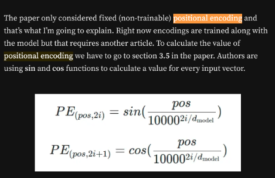

- *pos* — position of the vector
- *i* — index within the vector
- d\_{model} — dimension of the input

Consider the following example sentence: 

"The quick brown fox jumps over the lazy dog."

In this sentence, there are 9 words (tokens) and we can assign each word a position in the sequence, starting from 0. So, "The" is at position 0, "quick" is at position 1, "brown" is at position 2, and so on, until "dog" is at position 8.

Now, let's say we want to represent each word in the sentence as a vector in a 16-dimensional space. This means that each word will have a vector of length 16, where each dimension corresponds to a different feature of the word. For example, the first dimension might correspond to the frequency of the word in the English language, the second dimension might correspond to the number of syllables in the word, and so on.

The positional encoding vector is a vector that encodes the position of the word in the sequence. It has the same dimension as the input embeddings (in this case, 16). The positional encoding vector is added to the input embeddings to provide information about the position of the word in the sequence.

For example, let's say we want to calculate the positional encoding vector for the word "jumps" at position 4 in the sequence. 

We can use the formula for positional encoding to calculate the value of each dimension in the vector:

PE(4, 0) = sin(4 / 10000^(0 / 16))

PE(4, 1) = cos(4 / 10000^(0 / 16))

PE(4, 2) = sin(4 / 10000^(2 / 16))

PE(4, 3) = cos(4 / 10000^(2 / 16))...

PE(4, 15) = cos(4 / 10000^(15 / 16))

These values will be added to the input embeddings for the word "jumps" to provide information about its position in the sequence.

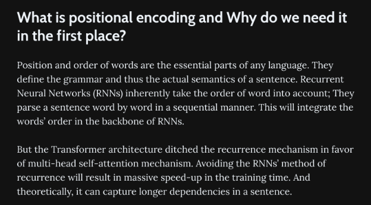

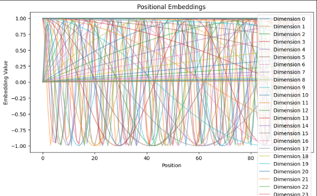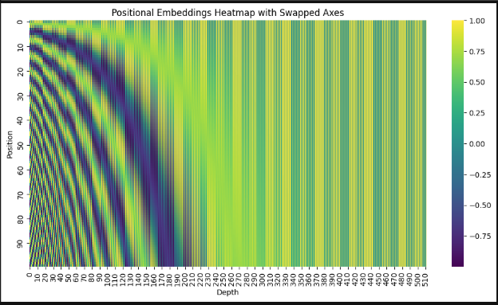

<https://kazemnejad.com/blog/transformer_architecture_positional_encoding/>

multi-head self-attention (**MHSA**) block.

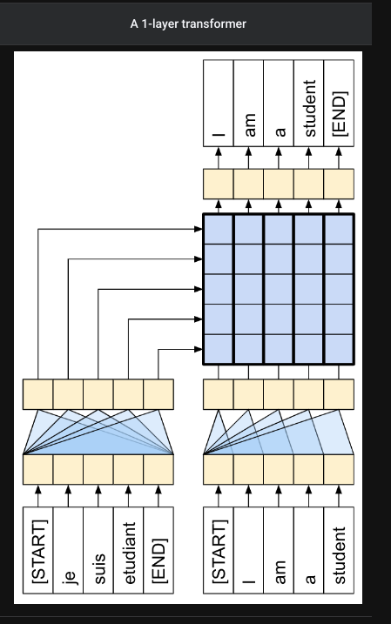

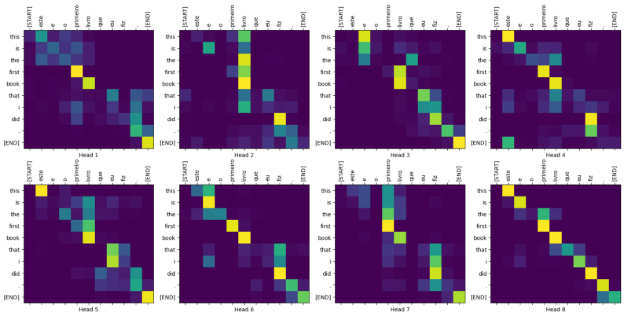

![ref1]

Direct trasnlatuion of book to italian

Positional embedding explained: 

Why it may be useful

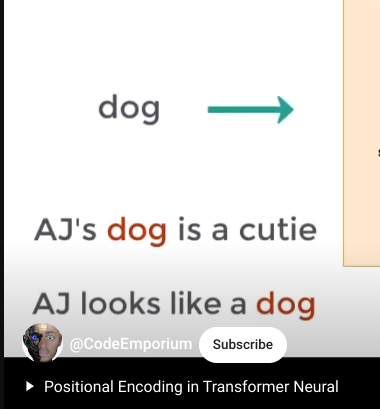

Context makes a difference

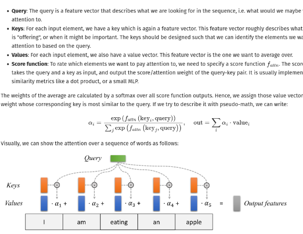Source :https://github.com/phlippe/uvadlc\_notebooks/blob/master/docs/tutorial\_notebooks/tutorial6/Transformers\_and\_MHAttention.ipynb

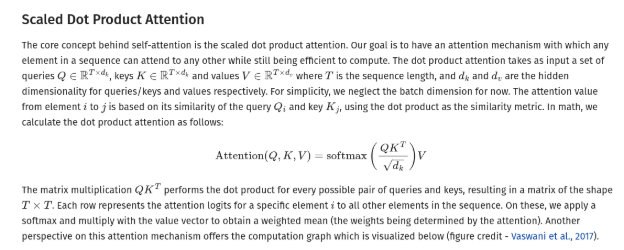

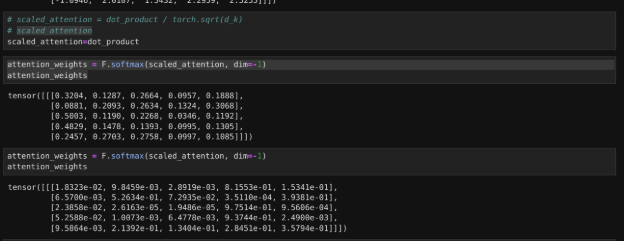

WIth and without scaling 

Code for testing scaling:

import torch

import torch.nn.functional as F

\# Define a simple scaled dot-product attention function

def scaled\_dot\_product\_attention(Q, K, d\_k):

`    `# Compute raw dot product

`    `dot\_product = torch.matmul(Q, K.transpose(1, 2))

`    `# Apply scaling factor

`    `scaled\_attention = dot\_product / torch.sqrt(d\_k)

`    `# Apply softmax to get attention weights

`    `attention\_weights = F.softmax(scaled\_attention, dim=-1)

`    `# Compute the weighted sum of values (V)

`    `output = torch.matmul(attention\_weights, K)

`    `return output, attention\_weights

\# Example input: Q (query), K (key), and V (value) vectors

Q = torch.randn(1, 5, 10)  # Batch size = 1, sequence length = 5, embedding dimension = 10

K = torch.randn(1, 5, 10)

V = torch.randn(1, 5, 10)

\# Dimension of key vectors (d\_k)

d\_k = torch.tensor(K.size(-1))

\# Compute scaled dot-product attention

output, attention\_weights = scaled\_dot\_product\_attention(Q, K, d\_k)

\# Print attention weights and output

print("Attention Weights:")

print(attention\_weights)

print("\nOutput after Attention:")

print(output)

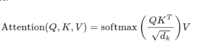

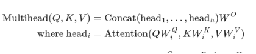

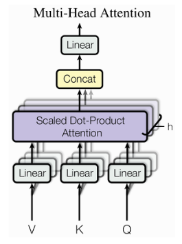

Scaled dot product is just an extension of the attention head. 

Instead there are multiple different heads.

import torch

import torch.nn.functional as F

\# Example input: Q (query), K (key), and V (value) vectors

d\_k = torch.tensor(64)  # Dimension of key vectors

num\_positions = 10

num\_heads = 4  # Number of attention heads

\# Generate random query and key vectors

Q = torch.randn(num\_positions, d\_k)

K = torch.randn(num\_positions, d\_k)  # Assume key vectors are also random

\# Define a multi-head scaled dot-product attention function

\# def multi\_head\_attention(Q, K, d\_k, num\_heads):

\# Split Q, K, and V into multiple heads

Q\_split = torch.chunk(Q, num\_heads, dim=-1)

K\_split = torch.chunk(K, num\_heads, dim=-1)

\# Compute attention for each head

attention\_outputs = []

for i in range(num\_heads):

`    `Q\_head = Q\_split[i]

`    `K\_head = K\_split[i]

`    `# Compute raw dot product for this head

`    `dot\_product = torch.matmul(Q\_head, K\_head.transpose(0, 1))

`    `# Apply scaling factor

`    `scaled\_attention = dot\_product / torch.sqrt(d\_k)

`    `# Apply softmax to get attention weights

`    `attention\_weights = F.softmax(scaled\_attention, dim=-1)

`    `# Compute the weighted sum of values (V)

`    `output = torch.matmul(attention\_weights, K\_head)

`    `attention\_outputs.append(output)

\# Concatenate the outputs from all heads

multi\_head\_output = torch.cat(attention\_outputs, dim=-1)

\# return multi\_head\_output, attention\_weights

Given that the sequence length affects the complexity: 

There is an upper bound on the character length as 4096

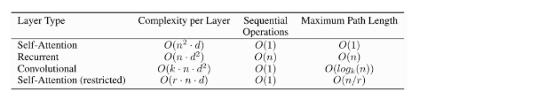

Reason for residual connection: 

ll outputs of the attention are likely to represent similar/same information, and there is no chance for the model to distinguish which information came from which input element. 

This is achieved by Positional embeddings

![ref1]

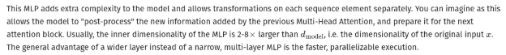![ref1]

Since in the pictogram there is a add and then normalize arrow, here the MLP is added to the output.

[ref1]: Aspose.Words.7eeafdf7-f625-43ba-a71b-faaf18899fb6.008.png
