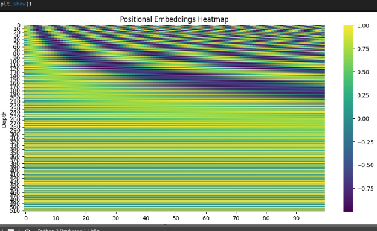

```
```python
print('PyDev console: using IPython 8.18.1\n')

import sys
print('Python %s on %s' % (sys.version, sys.platform))

sys.path.extend(['/root/PycharmProjects/Transformers_project'])

import torchtext.datasets as datasets
import torch
import torch.nn as nn
from torch.utils.data import Dataset, DataLoader, random_split
from torch.optim.lr_scheduler import LambdaLR
import warnings
from tqdm import tqdm
import os
from pathlib import Path
from datasets import load_dataset
from tokenizers import Tokenizer
from tokenizers.models import WordLevel
from tokenizers.trainers import WordLevelTrainer
from tokenizers.pre_tokenizers import Whitespace
import torchmetrics
from torch.utils.tensorboard import SummaryWriter
from torchmetrics.text import CharErrorRate, WordErrorRate, BLEUScore
from torchmetrics.text import BLEUScore, ROUGEScore

batch_size= 8
num_epochs= 2
lr= 10 ** -4
seq_len= 350
d_model= 512
datasource= 'opus_books'
lang_src= "en"
lang_tgt= "it"
model_folder= "weights"
model_basename= "tmodel_"
preload= "latest"
tokenizer_file= "tokenizer_{0}.json"
experiment_name= "runs/tmodel"

ds_raw = load_dataset(f"{datasource[0]}", f"{lang_src[0]}-{lang_tgt[0]}", split='train')

def get_all_sentences(ds, lang):
    for item in ds:
        yield item['translation'][lang]

ds_raw = load_dataset(f"{datasource[0]}", f"{lang_src[0]}-{lang_tgt[0]}", split='train')

import os
os.environ["TOKENIZERS_PARALLELISM"] = "false"

def get_all_sentences(ds, lang):
    for item in ds:
        yield item['translation'][lang]

tokenizer = Tokenizer(WordLevel(unk_token="[UNK]"))
tokenizer.pre_tokenizer = Whitespace()  # pre tokenizer is set to whitespace

trainer = WordLevelTrainer(special_tokens=["[UNK]", "[PAD]", "[SOS]", "[EOS]"], min_frequency=2)

tokenizer.train_from_iterator(get_all_sentences(ds_raw, lang_src[0]), trainer=trainer)
tokenizer_path = Path(tokenizer_file[0].format('en'))
tokenizer.save(str(tokenizer_path))

tokenizer_src=Tokenizer.from_file(str(Path(tokenizer_file[0].format('en'))))

tokenizer = Tokenizer(WordLevel(unk_token="[UNK]"))
tokenizer.pre_tokenizer = Whitespace()
trainer = WordLevelTrainer(special_tokens=["[UNK]", "[PAD]", "[SOS]", "[EOS]"], min_frequency=2)
tokenizer.train_from_iterator(get_all_sentences(ds_raw, lang_tgt[0]), trainer=trainer)

tokenizer_path = Path(tokenizer_file[0].format('it'))
tokenizer.save(str(tokenizer_path))

tokenizer_tgt=Tokenizer.from_file(str(Path(tokenizer_file[0].format('it'))))

ds_raw1 = ds_raw

keep_ds_size = int(0.2 * len(ds_raw))
discard_ds_size = len(ds_raw) - keep_ds_size
keep_ds, discard_ds = random_split(ds_raw, [keep_ds_size, discard_ds_size])

ds_raw = keep_ds
train_ds_size = int(0.9 * len(ds_raw))
val_ds_size = len(ds_raw) - train_ds_size

train_ds_raw, val_ds_raw = random_split(ds_raw, [train_ds_size, val_ds_size])

src_lang = lang_src[0]
tgt_lang = lang_tgt[0]

sos_token = torch.tensor([tokenizer_tgt.token_to_id("[SOS]")], dtype=torch.int64)
eos_token = torch.tensor([tokenizer_tgt.token_to_id("[EOS]")], dtype=torch.int64)
pad_token = torch.tensor([tokenizer_tgt.token_to_id("[PAD]")], dtype=torch.int64)

src_target_pair = train_ds_raw[5]
src_text = src_target_pair['translation'][src_lang]
tgt_text = src_target_pair['translation'][tgt_lang]

enc_input_tokens = tokenizer_src.encode(src_text).ids
dec_input_tokens = tokenizer_tgt.encode(tgt_text).ids

enc_num_padding_tokens = seq_len - len(enc_input_tokens) - 2

encoder_input = torch.cat(
    [
        sos_token,
        torch.tensor(enc_input_tokens, dtype=torch.int64),
        eos_token,
        torch.tensor([pad_token] * enc_num_padding_tokens, dtype=torch.int64),
    ],
    dim=0,
)

decoder_input = torch.cat(
    [
        sos_token,
        torch.tensor(dec_input_tokens, dtype=torch.int64),
        torch.tensor([pad_token] * dec_num_padding_tokens, dtype=torch.int64),
    ],
    dim=0,
)

label = torch.cat(
    [
        torch.tensor(dec_input_tokens, dtype=torch.int64),
        eos_token,
        torch.tensor([pad_token] * dec_num_padding_tokens, dtype=torch.int64),
    ],
    dim=0,
)

def causal_mask(size):
    mask = torch.triu(torch.ones((1, size, size)), diagonal=1).type(torch.int)
    return mask == 0

encoder_mask = (encoder_input != pad_token).unsqueeze(0).unsqueeze(0).int()
decoder_mask = (decoder_input != pad_token).unsqueeze(0).int() & causal_mask(decoder_input.size(0))

```


- *pos* — position of the vector
- *i* — index within the vector
- d\_{model} — dimension of the input


Consider the following example sentence: 

"The quick brown fox jumps over the lazy dog."

In this sentence, there are 9 words (tokens) and we can assign each word a position in the sequence, starting from 0. So, "The" is at position 0, "quick" is at position 1, "brown" is at position 2, and so on, until "dog" is at position 8.

Now, let's say we want to represent each word in the sentence as a vector in a 16-dimensional space. This means that each word will have a vector of length 16, where each dimension corresponds to a different feature of the word. For example, the first dimension might correspond to the frequency of the word in the English language, the second dimension might correspond to the number of syllables in the word, and so on.

The positional encoding vector is a vector that encodes the position of the word in the sequence. It has the same dimension as the input embeddings (in this case, 16). The positional encoding vector is added to the input embeddings to provide information about the position of the word in the sequence.

For example, let's say we want to calculate the positional encoding vector for the word "jumps" at position 4 in the sequence. 

We can use the formula for positional encoding to calculate the value of each dimension in the vector:

PE(4, 0) = sin(4 / 10000^(0 / 16))

PE(4, 1) = cos(4 / 10000^(0 / 16))

PE(4, 2) = sin(4 / 10000^(2 / 16))

PE(4, 3) = cos(4 / 10000^(2 / 16))...

PE(4, 15) = cos(4 / 10000^(15 / 16))

These values will be added to the input embeddings for the word "jumps" to provide information about its position in the sequence.




<https://kazemnejad.com/blog/transformer_architecture_positional_encoding/>

multi-head self-attention (**MHSA**) block.


![ref1]

Direct trasnlatuion of book to italian


Positional embedding explained: 

Why it may be useful


Context makes a difference

Source :https://github.com/phlippe/uvadlc\_notebooks/blob/master/docs/tutorial\_notebooks/tutorial6/Transformers\_and\_MHAttention.ipynb


WIth and without scaling 

Code for testing scaling:
```
import torch
import torch.nn.functional as F

# Define a simple scaled dot-product attention function
def scaled_dot_product_attention(Q, K, d_k):
    # Compute raw dot product
    dot_product = torch.matmul(Q, K.transpose(1, 2))

    # Apply scaling factor
    scaled_attention = dot_product / torch.sqrt(d_k)

    # Apply softmax to get attention weights
    attention_weights = F.softmax(scaled_attention, dim=-1)

    # Compute the weighted sum of values (V)
    output = torch.matmul(attention_weights, K)

    return output, attention_weights

# Example input: Q (query), K (key), and V (value) vectors
Q = torch.randn(1, 5, 10)  # Batch size = 1, sequence length = 5, embedding dimension = 10
K = torch.randn(1, 5, 10)
V = torch.randn(1, 5, 10)

# Dimension of key vectors (d_k)
d_k = torch.tensor(K.size(-1))

# Compute scaled dot-product attention
output, attention_weights = scaled_dot_product_attention(Q, K, d_k)

# Print attention weights and output
print("Attention Weights:")
print(attention_weights)

print("\nOutput after Attention:")
print(output)
```


Scaled dot product is just an extension of the attention head. 

Instead there are multiple different heads.
```
import torch
import torch.nn.functional as F

# Example input: Q (query), K (key), and V (value) vectors
d_k = torch.tensor(64)  # Dimension of key vectors
num_positions = 10
num_heads = 4  # Number of attention heads

# Generate random query and key vectors
Q = torch.randn(num_positions, d_k)
K = torch.randn(num_positions, d_k)  # Assume key vectors are also random

# Define a multi-head scaled dot-product attention function
# def multi_head_attention(Q, K, d_k, num_heads):

# Split Q, K, and V into multiple heads
Q_split = torch.chunk(Q, num_heads, dim=-1)
K_split = torch.chunk(K, num_heads, dim=-1)

# Compute attention for each head
attention_outputs = []
for i in range(num_heads):
    Q_head = Q_split[i]
    K_head = K_split[i]

    # Compute raw dot product for this head
    dot_product = torch.matmul(Q_head, K_head.transpose(0, 1))

    # Apply scaling factor
    scaled_attention = dot_product / torch.sqrt(d_k)

    # Apply softmax to get attention weights
    attention_weights = F.softmax(scaled_attention, dim=-1)

    # Compute the weighted sum of values (V)
    output = torch.matmul(attention_weights, K_head)
    attention_outputs.append(output)

# Concatenate the outputs from all heads
multi_head_output = torch.cat(attention_outputs, dim=-1)

# Return multi_head_output, attention_weights
```

Given that the sequence length affects the complexity: 

There is an upper bound on the character length as 4096


Reason for residual connection: 

ll outputs of the attention are likely to represent similar/same information, and there is no chance for the model to distinguish which information came from which input element. 

This is achieved by Positional embeddings

![ref1]

![ref1]

Since in the pictogram there is a add and then normalize arrow, here the MLP is added to the output.

[ref1]: Aspose.Words.7eeafdf7-f625-43ba-a71b-faaf18899fb6.008.png
